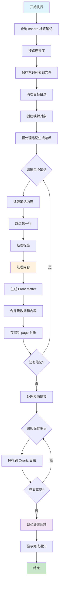
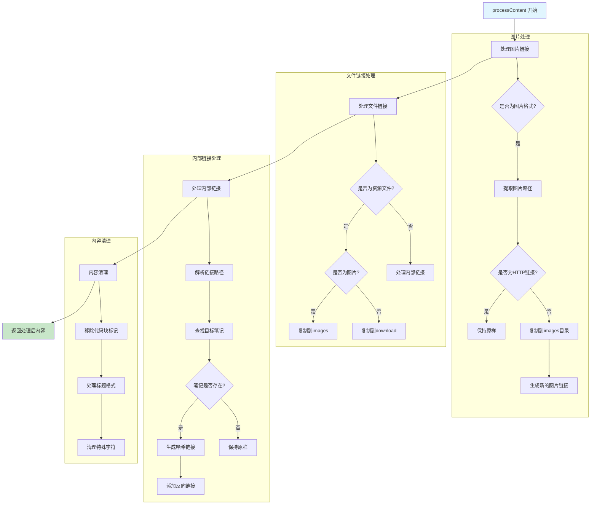

# ParseNote.js 脚本功能总结

## 概述

`ParseNote.js` 是一个在 Obsidian 中运行的脚本，用于将带有 `#share` 标签的笔记自动转换为 Quartz 博客格式。该脚本实现了从 Obsidian 笔记到静态博客的完整转换流程，包括内容处理、资源文件复制、元数据生成和自动部署。

## 主要功能

### 1. 笔记查询与筛选
- 使用 Dataview API 查询所有带有 `#share` 标签的笔记
- 按文件路径升序排序
- 生成笔记列表并保存到 `8.输出/hexo/Share_Tagged_Notes.md`

### 2. 内容处理与转换
- **内部链接处理**：将 Obsidian 的 `[[链接]]` 格式转换为 Markdown 链接
- **图片处理**：复制图片资源到 Quartz 的 `images` 目录
- **附件处理**：复制非图片资源到 `download` 目录
- **内容清理**：移除代码块标记、处理标题格式等

### 3. 元数据生成
- 生成 Front Matter 元数据，包括：
  - 标题、创建时间、更新时间
  - 分类（基于文件路径）
  - 标签（排除 `share` 标签）
  - 置顶标记（如果包含 `top` 标签）

### 4. 文件管理
- 清理目标目录（`content` 和 `public`）
- 使用 SHA1 哈希生成唯一文件名
- 保持原有的目录结构

### 5. 反向链接处理
- 构建笔记间的反向链接关系
- 可选择是否在笔记末尾添加 Backlinks 部分

### 6. 自动部署
- 调用 Shell Commands 插件执行部署命令
- 自动发布到 Quartz 博客

## 配置参数

```javascript
const config = {
    pathFrom: app.vault.adapter.basePath,     // Obsidian 笔记根目录
    pathTo: "D:/Git/Note/quartz",            // Quartz 博客根目录
    resourceFolder: "res",                    // 资源文件夹
    excludeFolders: ["res", "stash", ".obsidian", "7.输入", ".git"], // 排除文件夹
    shareTag: "#share",                       // 分享标签
    includeBacklinks: false                   // 是否包含反向链接
};
```

## 核心函数说明

### executeQueryAndSave()
主执行函数，协调整个转换流程：
1. 查询带有 `#share` 标签的笔记
2. 保存笔记列表
3. 调用 `processNotes()` 处理笔记
4. 调用 `deployHexoSite()` 部署网站

### processNotes(pages)
笔记处理核心函数：
1. 清理目标目录
2. 预处理笔记，生成哈希值
3. 处理每个笔记的内容
4. 处理反向链接
5. 保存到 Quartz 目录

### processContent(content, page, config, notesMap, backlinksMap)
内容处理函数：
1. 处理图片链接（`![[]]` 格式）
2. 处理文件链接和内部链接
3. 复制资源文件
4. 内容清理和格式化

### generateFrontMatter(page, tags, isTop, config)
生成 YAML Front Matter 元数据

### saveToHexo(page, config)
保存处理后的笔记到 Quartz 目录

### copyResource(resourcePath, config, targetFolder)
复制资源文件到指定目录

### deployHexoSite()
执行自动部署命令

## 执行流程详解

### 阶段一：初始化和查询
1. **查询笔记**：使用 Dataview API 查询所有带有 `#share` 标签的笔记
2. **排序**：按文件路径升序排序
3. **保存列表**：将笔记路径列表保存到 `8.输出/hexo/Share_Tagged_Notes.md`

### 阶段二：环境准备
1. **清理目标目录**：删除 Quartz 的 `content` 和 `public` 目录
2. **重建目录**：重新创建 `content` 目录
3. **初始化映射**：创建 `notesMap` 和 `backlinksMap`

### 阶段三：预处理
1. **遍历笔记**：为每个笔记生成唯一的哈希标识符
2. **特殊处理**：`index` 文件使用原名，其他文件使用 SHA1 哈希
3. **建立映射**：将笔记路径与笔记对象关联

### 阶段四：内容处理
1. **读取内容**：使用 Obsidian API 读取笔记内容
2. **跳过首行**：移除第一行内容
3. **处理标签**：提取标签并排除 `share` 标签
4. **内容转换**：调用 `processContent()` 处理链接和资源
5. **生成元数据**：创建 Front Matter
6. **合并内容**：将元数据和处理后的内容合并

### 阶段五：链接处理
1. **图片链接**：`![[图片]]` → ``
2. **文件链接**：复制到 `download` 目录
3. **内部链接**：`[[笔记]]` → `[笔记](哈希值)`
4. **反向链接**：构建笔记间的引用关系

### 阶段六：保存和部署
1. **保存文件**：将处理后的笔记保存到 Quartz 目录
2. **保持结构**：维护原有的目录层次
3. **自动部署**：调用 Shell Commands 执行部署脚本
4. **完成通知**：显示处理结果

## 主流程图



## 内容处理详细流程



## 关键特性

### 1. 智能链接转换
- **内部链接**：自动将 `[[笔记名]]` 转换为基于哈希的链接
- **别名支持**：处理 `[[笔记名|别名]]` 格式
- **标题锚点**：支持 `[[笔记名#标题]]` 格式的链接

### 2. 资源文件管理
- **图片资源**：自动复制到 `content/images/` 目录
- **附件资源**：自动复制到 `content/download/` 目录
- **路径编码**：正确处理包含特殊字符的文件名

### 3. 元数据生成
- **分类自动化**：基于文件路径自动生成分类
- **标签过滤**：排除 `share` 标签，保留其他标签
- **时间戳**：保留原始的创建和修改时间

### 4. 内容优化
- **格式清理**：移除 Obsidian 特有的标记
- **标题处理**：优化标题格式和间距
- **代码块**：处理特殊的代码块标记

## 使用方法

### 1. 准备工作
1. 确保安装了 Dataview 插件
2. 确保安装了 Shell Commands 插件
3. 配置部署命令 ID

### 2. 标记笔记
在需要发布的笔记中添加 `#share` 标签

### 3. 执行脚本
点击脚本生成的"更新 share 笔记"按钮

### 4. 自动化流程
脚本将自动完成：
- 内容转换
- 资源复制
- 文件保存
- 网站部署

## 注意事项

1. **路径配置**：确保 `pathTo` 指向正确的 Quartz 目录
2. **资源文件夹**：确保 `resourceFolder` 配置正确
3. **部署命令**：需要在 Shell Commands 插件中配置正确的部署命令
4. **权限问题**：确保脚本有读写目标目录的权限
5. **备份建议**：建议在首次使用前备份重要数据

## 扩展功能

脚本支持以下可选功能：
- **反向链接**：通过 `includeBacklinks` 配置启用
- **置顶文章**：通过 `#top` 标签标记
- **自定义排除**：通过 `excludeFolders` 配置排除特定文件夹

这个脚本为 Obsidian 用户提供了一个强大而灵活的博客发布解决方案，实现了从笔记到博客的无缝转换。